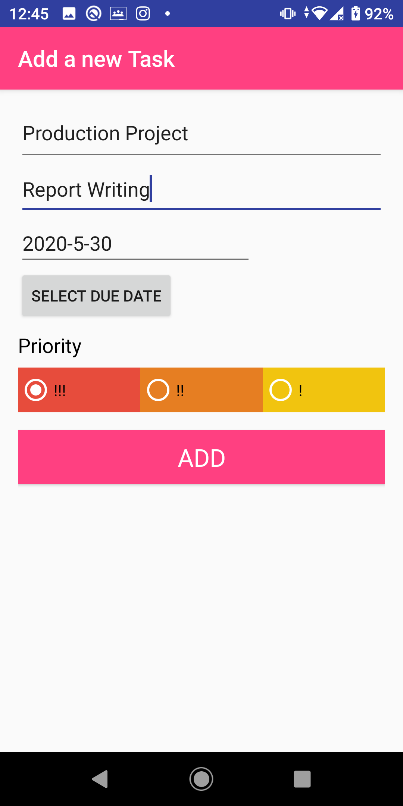
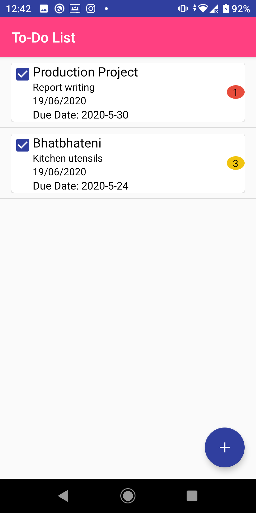
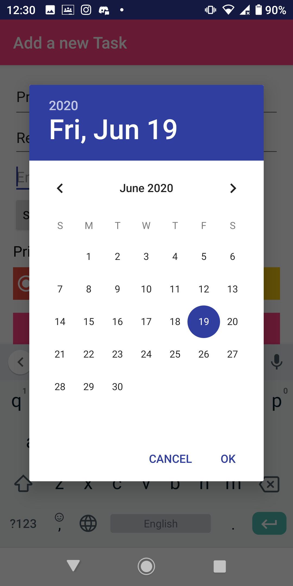

# TODO

Developing Mobile Application

TO-DO Application

Features:
•	Add your tasks.
•	Select a due date for your task
•	Add note briefly describing your task.
•	Set Priority as per your particular task.
•	Check the task that you have completed.
•	Edit the task created.
•	Swipe to delete the task created.

User Guide:
•	Adding tasks: 
The user can press the add floating button on the right in order to create a todo list. Here, the user can provide the description, note, due date and priority.

